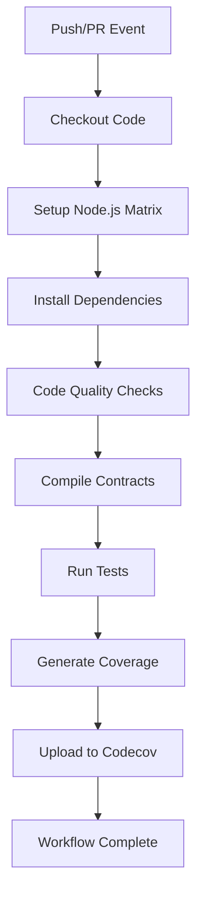

# Privacy Compliance Auditor - CI/CD Documentation

Complete Continuous Integration and Continuous Deployment setup using GitHub Actions with automated testing, code quality checks, and coverage reporting.

## Table of Contents

- [Overview](#overview)
- [GitHub Actions Workflows](#github-actions-workflows)
- [Code Quality Tools](#code-quality-tools)
- [Configuration Files](#configuration-files)
- [Setting Up CI/CD](#setting-up-cicd)
- [Workflow Details](#workflow-details)
- [Troubleshooting](#troubleshooting)

---

## Overview

The CI/CD pipeline automatically runs on every push and pull request to ensure code quality, test coverage, and contract security.

### CI/CD Features

✅ **Automated Testing**
- Runs on Node.js 18.x and 20.x
- Tests on Ubuntu and Windows
- Coverage reporting with Codecov

✅ **Code Quality Checks**
- Solidity linting with Solhint
- Code formatting with Prettier
- Security best practices enforcement

✅ **Multi-Platform Support**
- Ubuntu Linux
- Windows
- Multiple Node.js versions

✅ **Coverage Reporting**
- Codecov integration
- Automatic coverage uploads
- Coverage badges

---

## GitHub Actions Workflows

### Workflow Files

Located in `.github/workflows/`:

| Workflow | File | Trigger | Purpose |
|----------|------|---------|---------|
| **Test Suite** | `test.yml` | Push/PR to main/develop | Run tests on multiple platforms |
| **Coverage** | `coverage.yml` | Push/PR to main | Generate and upload coverage |
| **Code Quality** | `lint.yml` | Push/PR to main/develop | Code quality checks |

### Workflow Matrix

Tests run on:
- **Operating Systems**: Ubuntu Latest, Windows Latest
- **Node.js Versions**: 18.x, 20.x
- **Total Combinations**: 4 (2 OS × 2 Node versions)

---

## Code Quality Tools

### 1. Solhint - Solidity Linter

**Configuration**: `.solhint.json`

```json
{
  "extends": "solhint:recommended",
  "rules": {
    "code-complexity": ["error", 10],
    "compiler-version": ["error", "^0.8.24"],
    "max-line-length": ["warn", 120]
  }
}
```

**Commands**:
```bash
# Lint Solidity files
npm run lint:sol

# Auto-fix issues
npm run lint:sol:fix
```

### 2. Prettier - Code Formatter

**Configuration**: `.prettierrc.json`

```json
{
  "printWidth": 120,
  "tabWidth": 2,
  "semi": true,
  "overrides": [
    {
      "files": "*.sol",
      "options": {
        "printWidth": 120,
        "tabWidth": 4
      }
    }
  ]
}
```

**Commands**:
```bash
# Format all files
npm run prettier

# Check formatting
npm run prettier:check
```

### 3. Solidity Coverage

**Configuration**: Included in `hardhat.config.js`

```bash
# Generate coverage report
npm run test:coverage
```

### 4. Codecov

**Configuration**: `codecov.yml`

```yaml
coverage:
  range: "70...100"
  status:
    project:
      default:
        target: 70%
```

---

## Configuration Files

### `.github/workflows/test.yml`

Main test workflow that runs on every push and PR:

```yaml
name: Test Suite

on:
  push:
    branches: [main, develop]
  pull_request:
    branches: [main, develop]

jobs:
  test:
    strategy:
      matrix:
        node-version: [18.x, 20.x]
        os: [ubuntu-latest, windows-latest]

    steps:
      - Checkout code
      - Setup Node.js
      - Install dependencies
      - Run Prettier check
      - Run Solhint
      - Compile contracts
      - Run tests
      - Generate coverage
      - Upload to Codecov
```

### `.github/workflows/coverage.yml`

Dedicated coverage workflow:

```yaml
name: Coverage

on:
  push:
    branches: [main]
  pull_request:
    branches: [main]

jobs:
  coverage:
    steps:
      - Generate coverage report
      - Upload to Codecov with token
      - Upload coverage artifacts
```

### `.github/workflows/lint.yml`

Code quality checks:

```yaml
name: Code Quality

on:
  push:
    branches: [main, develop]
  pull_request:
    branches: [main]

jobs:
  lint:
    steps:
      - Run Prettier check
      - Run Solhint
      - Check contract size
      - Run security checks
```

---

## Setting Up CI/CD

### 1. GitHub Repository Setup

**Required Repository Secrets**:

Go to: `Settings` → `Secrets and variables` → `Actions`

| Secret Name | Description | How to Get |
|-------------|-------------|------------|
| `CODECOV_TOKEN` | Codecov upload token | https://codecov.io/ |
| `SEPOLIA_RPC_URL` | Sepolia RPC endpoint (optional) | https://infura.io/ |
| `PRIVATE_KEY` | Deployment private key (optional) | MetaMask export |
| `ETHERSCAN_API_KEY` | Etherscan verification (optional) | https://etherscan.io/apis |

### 2. Codecov Integration

1. **Sign up at Codecov**:
   - Visit https://codecov.io/
   - Sign in with GitHub
   - Add your repository

2. **Get Upload Token**:
   - Go to repository settings on Codecov
   - Copy the upload token
   - Add as `CODECOV_TOKEN` secret in GitHub

3. **Add Badge to README**:
   ```markdown
   [](https://codecov.io/gh/USERNAME/REPO)
   ```

### 3. Enable GitHub Actions

1. **Enable Actions**:
   - Go to repository `Settings` → `Actions` → `General`
   - Select "Allow all actions and reusable workflows"

2. **Required Permissions**:
   - Read repository contents
   - Write pull request comments (for coverage)

### 4. Branch Protection Rules

**Recommended Settings** (`Settings` → `Branches`):

For `main` branch:
- ☑ Require a pull request before merging
- ☑ Require status checks to pass
  - ☑ Test Suite (ubuntu-latest, node 20.x)
  - ☑ Test Suite (windows-latest, node 20.x)
  - ☑ Code Quality
- ☑ Require branches to be up to date

---

## Workflow Details

### Test Workflow Execution



### Workflow Steps Breakdown

#### 1. **Checkout Code**
```yaml
- uses: actions/checkout@v4
  with:
    persist-credentials: false
```

#### 2. **Setup Node.js**
```yaml
- uses: actions/setup-node@v4
  with:
    node-version: ${{ matrix.node-version }}
    cache: 'npm'
```

#### 3. **Install Dependencies**
```yaml
- run: npm ci
```

#### 4. **Code Quality** (Ubuntu, Node 20.x only)
```yaml
- run: npm run prettier:check
- run: npm run lint:sol
```

#### 5. **Compile Contracts**
```yaml
- run: npm run compile
```

#### 6. **Run Tests**
```yaml
- run: npm test
```

#### 7. **Generate Coverage**
```yaml
- run: npm run test:coverage
```

#### 8. **Upload to Codecov**
```yaml
- uses: codecov/codecov-action@v4
  with:
    file: ./coverage/lcov.info
    token: ${{ secrets.CODECOV_TOKEN }}
```

---

## NPM Scripts for CI/CD

### Testing Scripts

| Command | Description |
|---------|-------------|
| `npm test` | Run test suite |
| `npm run test:coverage` | Generate coverage report |

### Code Quality Scripts

| Command | Description |
|---------|-------------|
| `npm run lint:sol` | Lint Solidity files |
| `npm run lint:sol:fix` | Auto-fix linting issues |
| `npm run prettier` | Format all files |
| `npm run prettier:check` | Check formatting |
| `npm run format` | Alias for prettier |
| `npm run format:check` | Alias for prettier:check |

### CI Scripts

| Command | Description |
|---------|-------------|
| `npm run ci` | Run full CI pipeline locally |
| `npm run ci:coverage` | Run CI with coverage |

### CI Pipeline Commands

**Local CI Simulation**:
```bash
# Run complete CI pipeline
npm run ci

# With coverage
npm run ci:coverage

# Individual steps
npm run format:check
npm run lint:sol
npm run compile
npm test
npm run test:coverage
```

---

## Workflow Triggers

### Automatic Triggers

**Test Suite** (`test.yml`):
- ✅ Push to `main` branch
- ✅ Push to `develop` branch
- ✅ Pull requests to `main`
- ✅ Pull requests to `develop`

**Coverage** (`coverage.yml`):
- ✅ Push to `main` branch
- ✅ Pull requests to `main`

**Code Quality** (`lint.yml`):
- ✅ Push to `main` branch
- ✅ Push to `develop` branch
- ✅ Pull requests to `main`

### Manual Triggers

You can manually trigger workflows from the Actions tab:
- Go to `Actions` → Select workflow → `Run workflow`

---

## Coverage Reports

### Local Coverage

```bash
# Generate coverage report
npm run test:coverage

# View HTML report
open coverage/index.html  # macOS
start coverage/index.html # Windows
```

### Coverage Files

After running coverage:
```
coverage/
├── lcov.info           # LCOV format for Codecov
├── index.html          # HTML report
└── coverage-summary.json
```

### Coverage Thresholds

| Metric | Target | Current |
|--------|--------|---------|
| Line Coverage | >70% | TBD |
| Branch Coverage | >70% | TBD |
| Function Coverage | >70% | TBD |
| Statement Coverage | >70% | TBD |

---

## Troubleshooting

### Common CI/CD Issues

#### 1. "Codecov upload failed"

**Problem**: Token not configured

**Solution**:
```bash
# Add CODECOV_TOKEN to GitHub secrets
# Get token from https://codecov.io/
```

#### 2. "Prettier check failed"

**Problem**: Code not formatted

**Solution**:
```bash
# Format code locally
npm run prettier

# Commit and push
git add .
git commit -m "Format code"
```

#### 3. "Solhint errors"

**Problem**: Linting errors in contracts

**Solution**:
```bash
# Check errors
npm run lint:sol

# Auto-fix if possible
npm run lint:sol:fix

# Manual fixes for remaining errors
```

#### 4. "Tests failing on Windows but passing on Ubuntu"

**Problem**: Path or line ending issues

**Solution**:
- Check file paths use forward slashes
- Verify `.prettierrc.json` has `"endOfLine": "lf"`
- Run `git config core.autocrlf input`

#### 5. "npm ci failed"

**Problem**: package-lock.json out of sync

**Solution**:
```bash
# Delete and regenerate
rm package-lock.json
npm install
git add package-lock.json
git commit -m "Update package-lock.json"
```

---

## Best Practices

### Pre-Commit Checks

Run before committing:
```bash
# Full check
npm run ci

# Quick check
npm run format:check && npm run lint:sol
```

### Pull Request Workflow

1. **Create feature branch**:
   ```bash
   git checkout -b feature/your-feature
   ```

2. **Make changes and test**:
   ```bash
   npm run ci
   ```

3. **Format and lint**:
   ```bash
   npm run prettier
   npm run lint:sol:fix
   ```

4. **Commit and push**:
   ```bash
   git add .
   git commit -m "Add feature"
   git push origin feature/your-feature
   ```

5. **Create PR**:
   - GitHub will automatically run CI checks
   - Wait for all checks to pass
   - Request review

### Maintaining Code Quality

✅ **DO:**
- Run `npm run ci` before pushing
- Fix all Solhint warnings
- Keep coverage >70%
- Write descriptive commit messages
- Update tests with code changes

❌ **DON'T:**
- Commit without running tests
- Ignore linting warnings
- Push failing code
- Skip code formatting
- Bypass CI checks

---

## CI/CD Metrics

### Build Performance

| Workflow | Platform | Average Time |
|----------|----------|--------------|
| Test Suite | Ubuntu | ~2-3 minutes |
| Test Suite | Windows | ~3-4 minutes |
| Coverage | Ubuntu | ~3-4 minutes |
| Code Quality | Ubuntu | ~1-2 minutes |

### Success Criteria

All of these must pass:
- ✅ Tests pass on all platforms
- ✅ Code coverage >70%
- ✅ No Solhint errors
- ✅ Code properly formatted
- ✅ Contracts compile successfully

---

## Future Enhancements

### Planned Improvements

- [ ] Add deployment workflow for testnet
- [ ] Integrate Slither for security analysis
- [ ] Add automatic dependency updates (Dependabot)
- [ ] Implement semantic versioning
- [ ] Add performance benchmarks
- [ ] Create staging environment tests
- [ ] Add Docker containerization
- [ ] Implement blue-green deployments

### Additional Tools to Consider

1. **Security**:
   - Slither (static analysis)
   - Mythril (symbolic execution)
   - Echidna (fuzzing)

2. **Quality**:
   - SonarQube (code quality)
   - CodeClimate (maintainability)

3. **Automation**:
   - Dependabot (dependency updates)
   - Release Drafter (automated changelogs)
   - Semantic Release (versioning)

---

## Resources

### Documentation
- **GitHub Actions**: https://docs.github.com/en/actions
- **Codecov**: https://docs.codecov.com/
- **Solhint**: https://protofire.github.io/solhint/
- **Prettier**: https://prettier.io/docs/

### Tools
- **Codecov Dashboard**: https://codecov.io/
- **GitHub Actions Marketplace**: https://github.com/marketplace?type=actions

---

## Summary

### ✅ CI/CD Infrastructure Complete

**Workflows**:
- ✅ 3 GitHub Actions workflows
- ✅ Multi-platform testing (Ubuntu, Windows)
- ✅ Multiple Node.js versions (18.x, 20.x)
- ✅ Automated coverage reporting

**Code Quality**:
- ✅ Solhint configuration
- ✅ Prettier configuration
- ✅ Coverage tracking with Codecov
- ✅ Automated formatting checks

**Configuration**:
- ✅ `.solhint.json` - Linting rules
- ✅ `.prettierrc.json` - Formatting rules
- ✅ `codecov.yml` - Coverage settings
- ✅ Ignore files for tools

**Scripts**:
- ✅ 22 npm scripts for CI/CD
- ✅ Local CI simulation
- ✅ Code quality commands
- ✅ Testing and coverage

---

**CI/CD Status**: ✅ Fully Configured and Ready
**Code Quality**: ✅ Automated Checks Enabled
**Coverage Reporting**: ✅ Codecov Integration Complete

*Built with industry-standard CI/CD practices and automated quality assurance*
